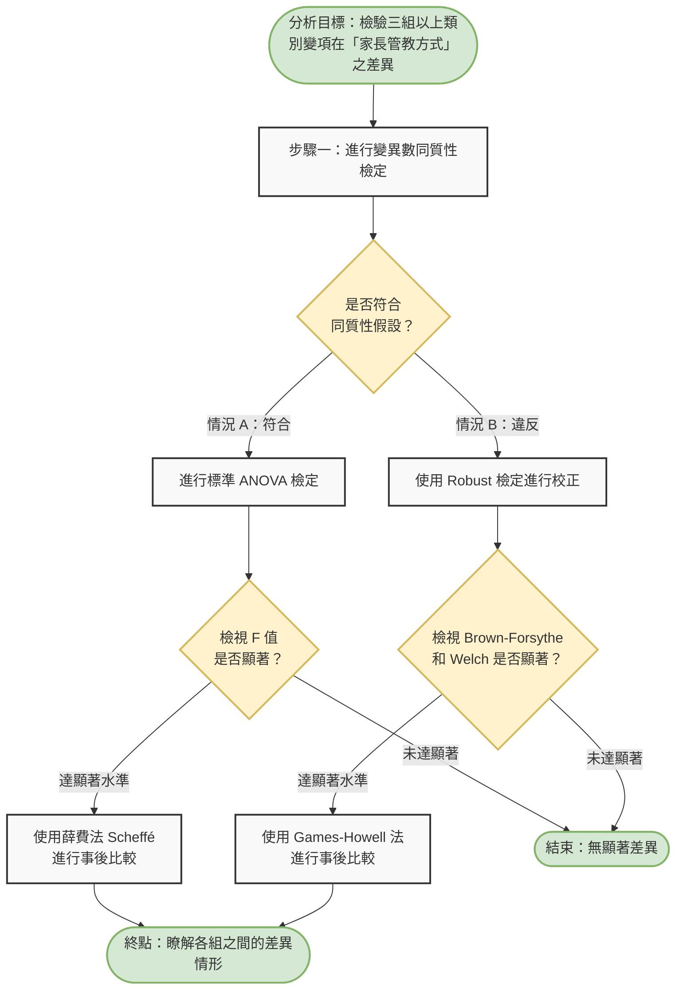

# 生成式AI
「單因子變異數分析」先進行變異數同質性檢定,若符合變異數同質性假設 ,且ANOVA 檢定之F值達顯著水準,則進行薛費法(Scheffé method)事後比 較;若違反變異數同質性假設,則使用 Robust檢定進行校正,檢視 Brown- Forsythe 和 Welch 統計量是否達顯著水準。若達顯著,則以Games-Howell 法進行 事後比較,以瞭解各組之間的差異情形。(GraphPad, 2016)。另針對「行動裝 置使用規範內容」中屬三組以上之類別變項,如每日使用時間長度、使用時段、 聯絡對象、遊戲功能及上網與學習功能等,亦採單因子變異數分析檢驗其在「家 長管教方式」各向度上之差異情形。
# Python 程式
在進行單因子變異數分析（One-way ANOVA）前，最常使用的變異數同質性檢定是 **Levene's Test（列文檢定）** 或 **Bartlett's Test**。一般情況下，建議使用對非常態分配較具強健性（Robust）的 Levene's Test。

以下我將提供兩種 Python 程式碼寫法：
第一種是使用最基礎的 `scipy` 套件進行**單純的同質性檢定**；第二種則是配合您前一個提問的流程，使用強大的統計套件 `pingouin` 來完成**包含後續檢定與事後比較的完整自動化流程**。

---

### 方法一：使用 `scipy.stats` 進行單純的變異數同質性檢定

這是最基本且常見的作法，只需要內建的 scipy 庫即可。

```python
import scipy.stats as stats
import pandas as pd

# 1. 準備模擬數據 (例如：三種不同「每日使用時間長度」組別在「家長管教方式」的得分)
group1 = [85, 86, 88, 75, 78, 94, 98, 79, 71, 80]
group2 = [91, 92, 93, 85, 87, 84, 82, 88, 95, 96]
group3 = [70, 73, 71, 75, 74, 69, 78, 77, 72, 79]

# 2. 進行 Levene's Test (變異數同質性檢定)
# center='median' 是預設值，對於非對稱分配的資料較為穩健
stat, p_value = stats.levene(group1, group2, group3, center='median')

print(f"Levene 檢定量 (W-value): {stat:.4f}")
print(f"P 值 (p-value): {p_value:.4f}")

# 3. 判斷同質性假設是否成立 (通常以 p < 0.05 為顯著水準)
alpha = 0.05
if p_value > alpha:
    print("結論：未達顯著水準 (p > 0.05)，【符合】變異數同質性假設。可以進行標準 ANOVA。")
else:
    print("結論：達顯著水準 (p <= 0.05)，【違反】變異數同質性假設。建議使用 Welch's ANOVA (Robust 檢定)。")

```

---

### 方法二：使用 `pingouin` 套件實作您的「完整判斷流程」

因為您先前提到的流程包含了 Welch's ANOVA、Games-Howell 事後比較等進階統計，強烈建議使用專為統計設計的 `pingouin` 套件，它可以一行代碼解決所有問題。（若未安裝，請先在終端機輸入 `pip install pingouin`）

```python
import pandas as pd
import pingouin as pg

# 1. 建立 Pandas DataFrame 格式的數據
data = pd.DataFrame({
    'Score': [85, 86, 88, 75, 78, 91, 92, 93, 85, 87, 70, 73, 71, 75, 74],
    'Group': ['A', 'A', 'A', 'A', 'A', 'B', 'B', 'B', 'B', 'B', 'C', 'C', 'C', 'C', 'C']
})

# 2. 進行變異數同質性檢定 (Levene's test)
# data: 資料集, dv: 依變項(Dependent Variable), group: 自變項(組別)
homoscedasticity = pg.homoscedasticity(data, dv='Score', group='Group', method='levene')
p_value_levene = homoscedasticity['pval'][0]
is_equal_var = homoscedasticity['equal_var'][0] # 回傳 True (符合) 或 False (違反)

print("=== 變異數同質性檢定結果 ===")
print(homoscedasticity)
print("-" * 30)

# 3. 根據同質性結果，自動走不同的統計路線
if is_equal_var:
    print("【路徑 A】：符合變異數同質性假設，進行標準 ANOVA。")
    # 標準單因子變異數分析
    anova_results = pg.anova(data=data, dv='Score', between='Group')
    print("\n--- Standard ANOVA 檢定結果 ---")
    print(anova_results)
    
    # 若達顯著，進行 Scheffé 等事後比較 (pingouin 未內建 Scheffé，但可用 Tukey 代替，或使用 scikit-posthocs)
    if anova_results['p-unc'][0] < 0.05:
        print("\nANOVA 達顯著差異，進行事後比較 (Post-hoc)...")
        posthoc = pg.pairwise_tukey(data=data, dv='Score', between='Group')
        print(posthoc)
    else:
        print("\nANOVA 未達顯著差異，結束分析。")

else:
    print("【路徑 B】：違反變異數同質性假設，使用 Welch's ANOVA。")
    # Welch's ANOVA (Robust 檢定)
    welch_results = pg.welch_anova(data=data, dv='Score', between='Group')
    print("\n--- Welch's ANOVA 檢定結果 ---")
    print(welch_results)
    
    # 若達顯著，進行 Games-Howell 事後比較
    if welch_results['p-unc'][0] < 0.05:
        print("\nWelch's ANOVA 達顯著差異，進行 Games-Howell 事後比較...")
        games_howell = pg.pairwise_gameshowell(data=data, dv='Score', between='Group')
        print(games_howell)
    else:
        print("\nWelch's ANOVA 未達顯著差異，結束分析。")

```

### 💡 核心觀念提醒

* **假設檢定的邏輯相反**：在變異數同質性檢定中，我們的虛無假設 ($H_0$) 是「各組變異數相等」。所以我們**希望 $p$ 值大於 $0.05$**，這樣才能保留 $H_0$，證明資料符合同質性假設。
* 如果遇到 Scheffé method 事後比較，`pingouin` 預設提供 Tukey 檢定，若一定要嚴格指定 Scheffé，在 Python 中可以額外安裝 `scikit-posthocs` 套件（`posthoc_scheffe`）來處理。

# 流程圖
在 GitHub 的 Markdown 中，最常使用且被原生支援的繪圖語法是 **Mermaid.js**。您只需要在 Markdown 檔案（例如 `README.md`）中使用 `mermaid ` 標籤將程式碼包起來，GitHub 就會自動將其渲染成視覺化的流程圖。

以下是為您將前面的單因子變異數分析邏輯，轉換為 Mermaid 語法的程式碼：

```markdown


```

### 💡 如何在 GitHub 上使用？

1. **複製**上面那一整段包含 ````mermaid ```` 的程式碼區塊。
2. **貼上**到您 GitHub 儲存庫中的任何 Markdown 檔案（例如 `README.md` 或是 Issue、Pull Request 的留言區）。
3. 切換到 **Preview（預覽）** 模式，您就會直接看到圖形化的流程圖，而不再只是純文字了。

```
面對「8組自變項（類別變項）」與「5組依變項（管教方式）」的分析結構，這意味著您總共需要進行 **$8 \times 5 = 40$ 次的單因子變異數分析 (One-way ANOVA)**。

如果手動進行這 40 次的「同質性檢定 $\rightarrow$ 挑選 ANOVA/Welch $\rightarrow$ 事後比較」，將會非常耗時且容易出錯。因此，最有效率的作法是撰寫一段 **Python 批次處理程式碼**，利用迴圈自動完成這 40 次檢定，並將結果輸出成一張總表（如 Excel 格式），方便您直接撰寫論文或報告。

以下為您提供批次處理的實作策略與自動化程式碼：

### ⚠️ 統計學上的小提醒 (Type I Error)

當您針對同一批樣本進行高達 40 次的 ANOVA 檢定時，會面臨「整體誤差率膨脹」（Family-wise Error Rate）的問題，也就是增加「型一錯誤」（偽陽性，誤判為有顯著差異）的機率。

* **建議解法 1**：在解讀 $p$ 值時，考慮採用 **Bonferroni 校正**（將判斷顯著的標準 $\alpha = 0.05$ 除以 40，改為 $p < 0.00125$ 才算顯著）。
* **建議解法 2**：若這 5 組管教方式彼此高度相關，您也可以考慮先跑 **MANOVA（多變量變異數分析）** 作為前置檢驗。

---

### 💻 Python 自動化批次分析程式碼

這段程式碼採用了您先前提出的完整判斷邏輯，並將其封裝在雙層迴圈中，最後會產出一份清晰的總結報表。

```python
import pandas as pd
import pingouin as pg
import numpy as np

# ==========================================
# 1. 建立模擬數據 (實務上請換成您的真實問卷資料)
# ==========================================
# 假設 8 組自變項 (Independent Variables)
iv_cols = [f'IV_變項{i}' for i in range(1, 9)] 
# 假設 5 組依變項 (Dependent Variables - 管教方式)
dv_cols = [f'DV_管教方式{j}' for j in range(1, 6)]

# 隨機生成 300 筆樣本資料做示範
np.random.seed(42)
data_dict = {iv: np.random.choice(['組別A', '組別B', '組別C', '組別D'], 300) for iv in iv_cols}
data_dict.update({dv: np.random.normal(loc=70, scale=10, size=300) for dv in dv_cols})
df = pd.DataFrame(data_dict)

# ==========================================
# 2. 自動化批次執行 8 x 5 = 40 次 ANOVA 流程
# ==========================================
summary_results = []

for dv in dv_cols:
    for iv in iv_cols:
        # Step 1: Levene's Test (變異數同質性檢定)
        levene_res = pg.homoscedasticity(df, dv=dv, group=iv, method='levene')
        is_equal_var = levene_res['equal_var'][0]
        levene_p = levene_res['pval'][0]
        
        test_used = ""
        f_val = 0
        p_val = 0
        is_sig = False
        posthoc_method = "無"
        
        # Step 2 & 3: 根據同質性結果決定分析路徑
        if is_equal_var:
            # 路徑 A: 符合同質性 -> Standard ANOVA
            test_used = "Standard ANOVA"
            anova_res = pg.anova(data=df, dv=dv, between=iv)
            f_val = anova_res['F'][0]
            p_val = anova_res['p-unc'][0]
            
            if p_val < 0.05:
                is_sig = True
                posthoc_method = "Scheffé (Tukey替代)" # 註: pingouin 用 tukey 實作最方便
                # 實務上這裡可以把事後比較的結果存入另一個 list 或 dict，這裡簡化標示
                
        else:
            # 路徑 B: 違反同質性 -> Welch's ANOVA
            test_used = "Welch's ANOVA"
            welch_res = pg.welch_anova(data=df, dv=dv, between=iv)
            f_val = welch_res['F'][0]
            p_val = welch_res['p-unc'][0]
            
            if p_val < 0.05:
                is_sig = True
                posthoc_method = "Games-Howell"
        
        # 將單次分析結果記錄下來
        summary_results.append({
            '依變項 (管教方式)': dv,
            '自變項 (類別)': iv,
            '同質性假設': '符合' if is_equal_var else '違反',
            '使用檢定法': test_used,
            'F 統計量': round(f_val, 3),
            'P 值': round(p_val, 4),
            '是否顯著差異 (p<0.05)': '⭐ 是' if is_sig else '否',
            '事後比較法': posthoc_method
        })

# ==========================================
# 3. 輸出並檢視最終報表
# ==========================================
results_df = pd.DataFrame(summary_results)

print(f"總共完成 {len(results_df)} 次分析。以下為前 10 筆結果摘要：\n")
print(results_df.head(10).to_string(index=False))

# 您可以將此結果匯出成 Excel，方便貼上論文：
# results_df.to_excel('ANOVA_8x5_分析結果總表.xlsx', index=False)

```

### 📝 報表欄位說明

執行這段程式碼後，您會得到一張擁有 40 列資料的 DataFrame（或 Excel 表格），每個欄位的意思如下：

1. **依變項 & 自變項**：清楚標示當下這行是在看哪一組變數的配對。
2. **同質性假設**：程式會自動判斷該配對是「符合」還是「違反」。
3. **使用檢定法**：程式根據同質性結果，自動填入 `Standard ANOVA` 或 `Welch's ANOVA`。
4. **P 值 & 是否顯著**：幫您標示出 $p < 0.05$ 的配對，加上星星符號（⭐），讓您能一眼看出這 40 組中有哪些具有顯著差異。
5. **事後比較法**：若無顯著差異則顯示「無」，若有顯著差異則自動標示應該對應去看哪一種事後比較的報表。
