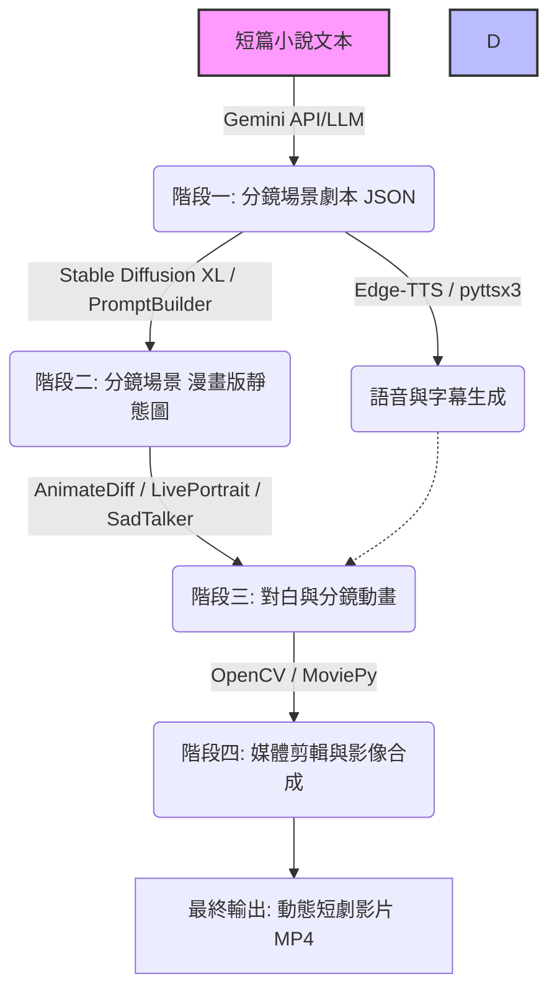

```mermaid
graph TD
    A[短篇小說文本] -->|Gemini API/LLM| B(階段一: 分鏡場景劇本 JSON)
    B -->|Stable Diffusion XL / PromptBuilder| C(階段二: 分鏡場景 漫畫版靜態圖)
    B -->|Edge-TTS / pyttsx3| D1(語音與字幕生成)
    C -->|AnimateDiff / LivePortrait / SadTalker| D2(階段三: 對白與分鏡動畫)
    D1 -.-> D2
    D2 -->|OpenCV / MoviePy| E(階段四: 媒體剪輯與影像合成)
    E --> F[最終輸出: 動態短劇影片 MP4]

    style A fill:#f9f,stroke:#333,stroke-width:2px
    style D fill:#bbf,stroke:#333,stroke-width:2px
```
